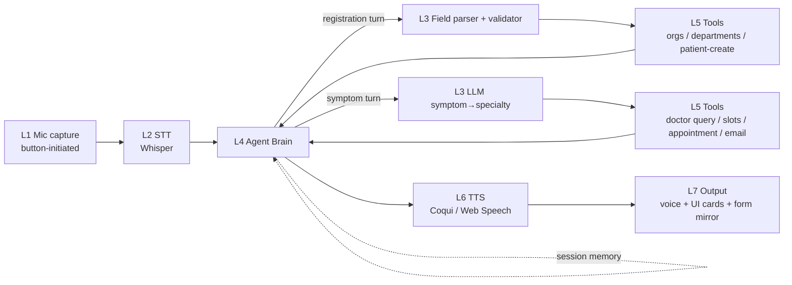
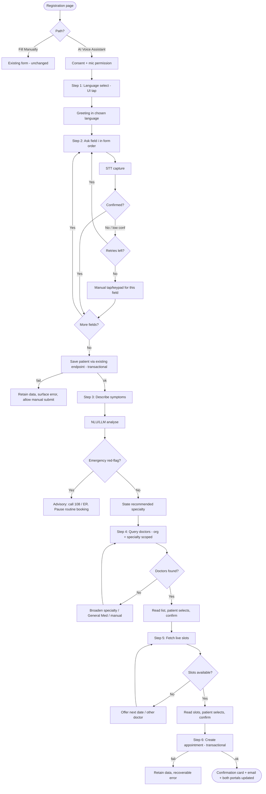
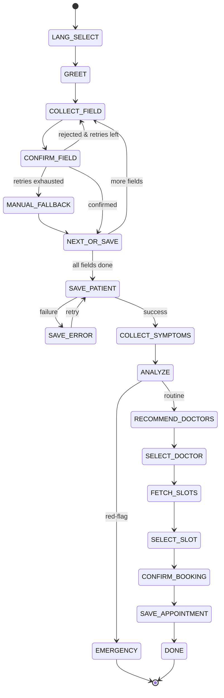
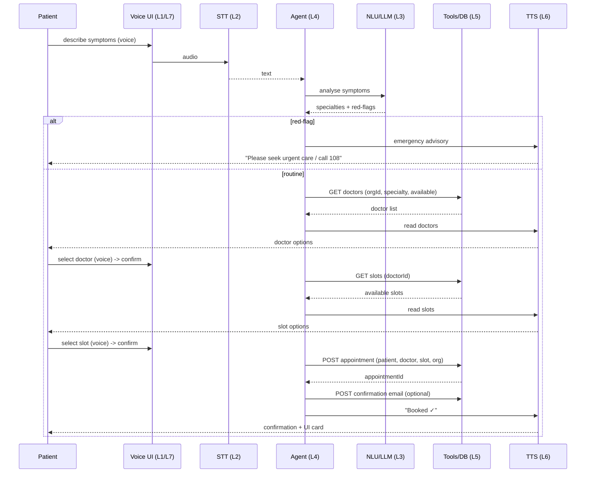

# Technical Workflow Document
## AI Voice-Assisted Patient Registration & Appointment Booking

| Field | Value |
|---|---|
| **Product** | Axten Hospitals — Patient Portal (Avani platform) |
| **Feature** | AI Voice-Assisted Patient Registration & Appointment Booking Flow |
| **Document type** | Technical Workflow / Solution Design |
| **Status** | Draft v1.0 — for review |
| **Companion** | Product Requirements Document |
| **Architecture ref** | Image 1 — 7-layer voice stack |

---

## 1. Architecture Overview

The feature implements the 7-layer pipeline from Image 1. Below is each layer with the **recommended production choice** and rationale, given the constraints of multilingual support (EN/HI), PHI sensitivity, and a Node.js/PostgreSQL portal.

| Layer | Options (Img1) | Recommended for production | Rationale |
|---|---|---|---|
| **L1 — Input** | Wake word, mic capture, PCM, WebRTC | Button-initiated mic capture (Web Audio/MediaRecorder); WebRTC only if streaming STT | No always-on listening in v1; simplest reliable capture |
| **L2 — STT** | Whisper, Vosk, Web Speech API | **Whisper (faster-whisper self-hosted, or Groq-hosted whisper-large-v3)** | Best multilingual accuracy incl. Hindi; PHI control via self-host; Groq for low latency. Avoid Web Speech API for PHI (audio leaves to a third party) and weak language control |
| **L3 — NLU** | Rasa, Ollama (Llama 3), Groq | **Hybrid: deterministic parsers for form fields + LLM (Groq/Ollama) for symptom→specialty** | Field values need strict parsing/validation, not an LLM; symptom routing benefits from an LLM constrained by a reference map |
| **L4 — Agent brain** | LangGraph/LangChain, dialogue state machine, memory buffer | **Deterministic dialogue state machine for registration; LangGraph (tool-calling) for symptom→doctor→slot**; session memory buffer throughout | Strict ordered form-fill must be guaranteed → FSM. Open-ended routing/booking → agent with tools |
| **L5 — Tools** | Hospital/doctor DB (PG + similarity), appointment engine, email, RAG, specialty filter, calendar/slots | PostgreSQL (existing), org-scoped doctor query + specialty filter, slots API, appointment engine, email (Resend/SendGrid) | Reuse existing data services; add specialty similarity search for routing |
| **L6 — TTS** | Coqui, Web SpeechSynthesis, pyttsx3 | **Coqui/XTTS self-hosted** (natural, multilingual) with **Web SpeechSynthesis** as zero-cost fallback | Hindi voice quality + PHI control; browser TTS as resilient fallback |
| **L7 — Output** | Voice, UI cards, email, Booked ✓ | Voice reply + progressively-filled form + doctor/slot cards + confirmation card + email | Mirrors manual form for transparency and tap-correction |

### 1.1 Key architectural decisions
1. **FSM, not free agent, for registration.** Steps 1–2 run on a deterministic dialogue state machine so field order, confirmation, and "no assumptions" are structurally guaranteed. The LLM never decides which field comes next.
2. **Reuse the existing form component + save endpoint.** The new voice page renders the same registration form (Img3). Voice progressively populates it; the patient sees and can tap-correct values; the final write hits the **same** `POST` patient-create path. This guarantees schema parity (NFR-3, NFR-8).
3. **Tenant scoping is enforced server-side.** After the hospital is chosen, `organisation_id` is attached to the session and every department/doctor/slot query is filtered by it server-side — not trusted from the client (NFR-4).
4. **Confirm-before-commit at every value.** No field, doctor, or slot is committed on a single unconfirmed utterance.

---

## 2. Component / Pipeline View

---

## 3. End-to-End Flow with Decision Points

---

## 4. Per-Step Technical Detail

For each step: **input → processing → layers involved → API/DB → output → errors.**

### Step 1 — Language Selection
- **Input:** UI tap (no voice).
- **Processing:** Set `session.language`; load localized prompt/voice config.
- **Layers:** L4 (session memory). L2/L3/L6 are configured to the language.
- **API/DB:** none (or GET supported-languages config).
- **Output:** Greeting begins (L7 voice).
- **Errors:** Unsupported language → default to English or show available set.

### Step 2 — Voice-Assisted Registration Fill
- **Input:** Per-field voice utterances (L1 → L2).
- **Processing:** FSM advances field-by-field in form order. Per field: STT → deterministic parse/validate (L3) → read-back confirmation (L6) → commit to in-memory form state → mirror into on-screen form. Hospital and Department options come from live lookups; Age may be derived from confirmed DOB.
- **Layers:** L1, L2, L3 (parsers/validators), L4 (FSM + memory), L5 (orgs, departments, patient-create), L6, L7.
- **API/DB:**
  - `GET /api/organisations` → hospital list.
  - `GET /api/organisations/:orgId/departments` → department list (after hospital chosen).
  - `POST /api/patients` → create patient (same payload/path as manual form) once all fields confirmed.
- **Output:** Saved patient + patient ID; progressively-filled form (L7).
- **Errors:** Low-confidence STT → re-prompt (≤ N) → manual fallback for that field; validation failure → re-ask with constraint reminder; hospital/department no-match → re-read candidates; **save failure → retain all captured data, surface recoverable error, allow manual submit of the captured form**.

### Step 3 — Symptom Collection
- **Input:** Free-form symptom utterance (L1 → L2).
- **Processing:** LLM (L3) extracts clinical concepts and maps to specialty(ies), constrained by a maintained symptom→specialty reference (RAG/specialty filter). Runs **red-flag detection** first.
- **Layers:** L1, L2, L3 (LLM), L4, L5 (RAG/specialty reference), L6.
- **API/DB:** `POST /api/voice/nlu/symptoms` → `{ specialties: [...], redFlags: [...], confidence }`. Optional read against a specialty reference table.
- **Output:** Stated recommended specialty (L6/L7), or emergency advisory.
- **Errors:** Empty/unintelligible symptoms → re-prompt or offer to pick a department manually; **red-flag detected → emergency advisory, pause routine booking** (offer to continue only as appropriate).

### Step 4 — Doctor Recommendation
- **Input:** Resolved specialty + `organisation_id` (from session); then patient's voice selection.
- **Processing:** Query doctors live, scoped to org + specialty + accepting-appointments; rank (optionally by similarity/availability); read aloud + render cards (L7); parse and confirm selection (L4).
- **Layers:** L4, L5 (doctor DB + specialty filter), L6, L7.
- **API/DB:** `GET /api/organisations/:orgId/doctors?specialty=<spec>&available=true`.
- **Output:** Selected `doctor_id` (confirmed) + doctor cards.
- **Errors:** No match → broaden to related specialty / General Medicine / manual pick (never fabricate a doctor); selection unclear → re-read numbered list.

### Step 5 — Appointment Slot Selection
- **Input:** Selected `doctor_id`; then patient's voice selection.
- **Processing:** Fetch live slots for the doctor; read aloud + render cards; parse and confirm selection.
- **Layers:** L4, L5 (calendar/slots API), L6, L7.
- **API/DB:** `GET /api/doctors/:doctorId/slots?date=<optional>` → available slots only.
- **Output:** Selected `slot_id` / datetime (confirmed).
- **Errors:** No slots → offer next available date or alternate doctor (loop back); slot taken between read and select → re-fetch and re-offer (prevents double-book).

### Step 6 — Booking Confirmation
- **Input:** `{ patientId, doctorId, slotId, organisationId }`.
- **Processing:** Create appointment transactionally (lock/verify slot still free); generate confirmation; trigger optional email; ensure both-portal visibility via shared source of truth.
- **Layers:** L4, L5 (appointment engine + email), L7.
- **API/DB:** `POST /api/appointments`; `POST /api/notifications/appointment-confirmation` (optional).
- **Output:** Confirmation card (L7), email, "Booked ✓"; appointment visible on patient and doctor portals.
- **Errors:** Slot lost on commit → re-offer slots; write failure → recoverable error, retain captured data, no orphan/duplicate (idempotent).

---

## 5. Data Flow (in → out per step)

| Step | Goes in | Comes out |
|---|---|---|
| 1 Language | UI tap | `session.language` |
| 2 Reg fill | voice per field + live org/dept lists | confirmed 12 fields → **saved patient + patientId** |
| 3 Symptoms | symptom audio → text | `{ specialties[], redFlags[] }` |
| 4 Doctor | specialty + orgId + voice selection | confirmed `doctorId` |
| 5 Slot | doctorId + voice selection | confirmed `slotId/datetime` |
| 6 Confirm | patientId + doctorId + slotId + orgId | `appointmentId` + confirmation + portal reflection |

---

## 6. API / Database Interaction Points

| Endpoint (proposed) | Method | Layer | Scope | Purpose |
|---|---|---|---|---|
| `/api/organisations` | GET | L5 | global | Hospital/clinic list (Step 2) |
| `/api/organisations/:orgId/departments` | GET | L5 | org | Department list (Step 2) |
| `/api/patients` | POST | L5 | org | Create patient — **same as manual form** (Step 2) |
| `/api/voice/nlu/symptoms` | POST | L3 | session | Symptom analysis + specialty + red-flags (Step 3) |
| `/api/organisations/:orgId/doctors` | GET | L5 | org | Doctors by specialty, available (Step 4) |
| `/api/doctors/:doctorId/slots` | GET | L5 | org | Live available slots (Step 5) |
| `/api/appointments` | POST | L5 | org | Create appointment (Step 6) |
| `/api/notifications/appointment-confirmation` | POST | L5 | org | Confirmation email (Step 6, optional) |

*All org-scoped endpoints derive `organisation_id` from the authenticated/session context server-side; the client value is not trusted (NFR-4).*

**Entities touched:** `organisation`, `department`, `patient`, `doctor`, `slot`, `appointment` (names indicative — reconcile with actual schema).

---

## 7. Layer → Step Mapping (Image 1)

| Flow step | L1 Input | L2 STT | L3 NLU | L4 Agent | L5 Tools | L6 TTS | L7 Output |
|---|:--:|:--:|:--:|:--:|:--:|:--:|:--:|
| 1 Language | ✔ (UI) | – | – | ✔ session | – | – | ✔ screen |
| 2 Reg fill | ✔ | ✔ | ✔ parsers | ✔ FSM | ✔ orgs/dept/patient | ✔ | ✔ form mirror |
| 3 Symptoms | ✔ | ✔ | ✔ LLM | ✔ | ✔ specialty ref | ✔ | – |
| 4 Doctor | ✔ | ✔ | ✔ select | ✔ | ✔ doctor DB+filter | ✔ | ✔ cards |
| 5 Slot | ✔ | ✔ | ✔ select | ✔ | ✔ slots API | ✔ | ✔ cards |
| 6 Confirm | – | – | – | ✔ finalize | ✔ appt+email | ✔ | ✔ card+email+portals |

---

## 8. Dialogue State Machine (registration + booking)

The FSM holds, in session memory (L4): selected language, `organisation_id`, the in-progress form state, resolved specialty, selected doctor, and selected slot.

---

## 9. Sequence — Symptom → Doctor → Slot → Booking

---

## 10. Error-Handling Matrix

| Stage | Failure | Handling |
|---|---|---|
| STT (any step) | Low confidence / silence / noise | Re-prompt with guidance (≤ N); show live transcript; after N → manual fallback for that step, **no data loss** |
| Language | Unsupported | Default to English or present supported set |
| Field parse | Invalid value (bad phone/email/date) | Re-ask with constraint reminder; offer spell/keypad mode |
| Hospital/Dept | No fuzzy match | Re-read top candidates; ask to choose one |
| Patient save | DB/network failure | Retain captured form, recoverable error, retry; idempotent to avoid duplicates; allow manual submit |
| Symptoms | Unintelligible / empty | Re-prompt; offer manual department pick |
| Symptoms | **Emergency red-flag** | Emergency advisory (108/ER); pause routine booking |
| Doctors | None found | Broaden to related specialty / General Medicine / manual pick; never fabricate |
| Slots | None available | Offer next date / alternate doctor; loop |
| Slots | Taken between read & select | Re-fetch + re-offer (prevent double-book) |
| Booking | Write failure | Recoverable error; retain data; no orphan/duplicate appointment |
| Cross-portal | Not visible on a portal | Both portals must read shared source of truth — treated as a blocking defect (100% requirement) |
| TTS | Synthesis failure | Fall back to browser SpeechSynthesis; show text on screen |
| Network | Timeout anywhere | Preserve session state; resume on reconnect |

---

## 11. Implementation Notes & Integration Checklist

- **Reuse, don't fork.** Render the existing registration form component on the voice page; bind voice-confirmed values into its state; submit through the existing patient-create path. This is the cleanest way to satisfy "compatible with existing codebase and schema."
- **Server-side tenant scoping.** Resolve `organisation_id` server-side for every org-scoped query; never trust a client-supplied org id for data access.
- **Idempotent writes.** Add an idempotency key to patient and appointment creation so a retried voice save can't duplicate.
- **PHI posture.** Prefer self-hosted Whisper + Coqui (or a PHI-safe hosted tier) over browser Web Speech for production; do not persist audio by default; encrypt transcripts; capture consent before mic activation.
- **Specialty reference.** Maintain a curated symptom→specialty map to constrain the LLM; log low-confidence routings for review.
- **Observability.** Per-step telemetry (STT confidence, retries, fallback rate, latency) feeding the PRD success metrics.

### Open questions to confirm against the real system
1. Exact patient-create endpoint/payload used by the manual form (to reuse verbatim).
2. Doctor entity's specialty attribute and how availability is represented.
3. Slots/calendar data model and how double-booking is currently prevented.
4. Shared source of truth ensuring an appointment shows on both portals.
5. Confirmed language launch set and TTS voice availability per language.
6. Whether Email is a required field for booking confirmation or optional.
