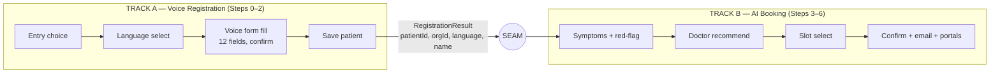

# Work Split & Parallelization Plan
## AI Voice-Assisted Patient Registration & Appointment Booking — 2 Developers

| Field | Value |
|---|---|
| **Goal** | Split the feature into two independent tracks so two devs work in parallel with **zero merge conflicts** |
| **Companion docs** | PRD · Technical Workflow Document |
| **Status** | Draft v1.0 |

---

## 0. The principle (why this avoids conflicts)

Merge conflicts come from **two people editing the same file**, not from working on the same feature. So this plan is built on three rules:

1. **Disjoint file ownership** — each track owns its own folders/files. Neither edits the other's.
2. **A frozen seam** — a tiny set of shared contract files (types + the handoff payload + API shapes) is agreed and locked on Day 0. After that it changes only by joint PR (rare).
3. **Mock-driven parallel dev** — each track ships against a *mock* of the other side, so neither is ever blocked and each can be merged independently.

The seam is placed at the **natural handoff point: after the patient is registered.** Track A turns voice into a saved patient. Track B takes a saved patient and turns it into a booked appointment.



Everything to the **left** of the seam is Track A. Everything to the **right** is Track B. The arrow across the seam is the *only* runtime dependency between them, and it's a small typed object.

---

## 1. The seam (the only shared contract)

Defined once, in `lib/contracts/`, on Day 0. **Locked thereafter.** Both devs code against these; changing them requires a joint PR.

```ts
// lib/contracts/voice.ts  — FROZEN

export type LanguageCode = 'en' | 'hi'; // launch set; extend by config

// The handoff payload Track A produces and Track B consumes.
export interface RegistrationResult {
  patientId: string;
  organisationId: string;   // scopes ALL of Track B's queries
  language: LanguageCode;    // session language chosen in Step 1
  patientName: string;       // for personalised TTS in booking
}

// The shared voice kernel that BOTH tracks call (impl owned by A, see §4).
export interface VoiceSession {
  language: LanguageCode;
  listen(): Promise<{ text: string; confidence: number }>; // L1 + L2 (STT)
  speak(text: string): Promise<void>;                       // L6 (TTS)
  get<T>(key: string): T | undefined;                       // session memory
  set<T>(key: string, value: T): void;
}
```

API shapes for Track B's endpoints are already specified in the Technical Workflow Document (§6) — those are part of the frozen contract too.

---

## 2. Track A — Voice Registration

**Owns Steps 0, 1, 2 + the shared voice kernel.** Delivers a registered patient and a working `VoiceSession`.

### Scope / deliverables
- Entry choice on the registration page: **Fill Manually** (unchanged) vs **Register with AI Voice Assistant**.
- Consent + mic permission, then **Step 1** language selection (UI tap).
- **Step 2** field FSM: ask the 12 fields in exact form order, confirm-before-accept, validation, voice-hostile-field handling (email/phone/DOB), derive+confirm Age.
- Reuse the existing registration form component as the on-screen mirror; tap-correctable.
- Save via the **existing** patient-create endpoint; on success, emit a `RegistrationResult`.
- **The shared voice kernel** (`listen`/`speak`/session) implementing the `VoiceSession` contract.

### Owned endpoints
- `GET /api/organisations` (if not already present) and `GET /api/organisations/:orgId/departments`.
- Integration with the existing `POST /api/patients` (reuse, don't reimplement).

### Definition of done
- A user can complete voice registration end-to-end and a schema-identical patient row is created.
- `VoiceSession` is implemented and exported behind the contract.
- Emits a valid `RegistrationResult`. Verified standalone using a **mock booking handler** (logs the payload).

---

## 3. Track B — AI Booking

**Owns Steps 3, 4, 5, 6 + the agent/LLM orchestration for booking.** Consumes a `RegistrationResult` and `VoiceSession`; never touches registration code.

### Scope / deliverables
- **Step 3** symptom capture + NLU/LLM specialty routing + **emergency red-flag** detection.
- **Step 4** live doctor query (org + specialty scoped), voice selection, doctor cards.
- **Step 5** live slot fetch, voice selection, slot cards.
- **Step 6** appointment create (transactional, idempotent), confirmation card, optional email, **both-portal reflection**.
- LangGraph/agent orchestration tying 3→6 together, using the injected `VoiceSession`.

### Owned endpoints
- `POST /api/voice/nlu/symptoms`
- `GET /api/organisations/:orgId/doctors`
- `GET /api/doctors/:doctorId/slots`
- `POST /api/appointments`
- `POST /api/notifications/appointment-confirmation`

### Definition of done
- Given a `RegistrationResult` + a `VoiceSession`, a user goes symptoms → doctor → slot → booked, visible on both portals.
- Verified standalone using a **mock `RegistrationResult`** (hardcoded patient/org) and a **mock `VoiceSession`** (scripted text in / no-op speak), so B needs nothing from A to run.

---

## 4. Shared kernel & how it stays conflict-free

The voice kernel (STT client, TTS client, mic capture, session memory, language config, voice UI shell) is used by **both** tracks — so it's the one piece of genuinely shared *runtime* code.

Handling:
- **Track A builds and owns the kernel implementation** (`lib/voice/*`, `components/voice/*`).
- **Track B only imports it via the `VoiceSession` interface — never edits kernel files.**
- Because B codes against the interface (and a mock during dev), A can refactor kernel internals freely as long as the contract holds. No shared-file edits ⇒ no conflict.

If A's kernel isn't ready when B starts, B uses this mock and swaps it at integration:

```ts
// Track B local mock — deleted at integration
const mockSession: VoiceSession = {
  language: 'en',
  listen: async () => ({ text: scriptedInputs.shift() ?? '', confidence: 1 }),
  speak: async (t) => console.log('[TTS]', t),
  get: () => undefined,
  set: () => {},
};
```

---

## 5. File / directory ownership map

`[A]` = Track A only · `[B]` = Track B only · `[FROZEN]` = joint, locked Day 0 · `[COORD]` = additive + announce.

```
app/  (or pages/)
  patient/
    register/page.tsx                                   [A]  add Manual|Voice choice
    register/voice/page.tsx                             [A]  voice registration route
    appointment/voice/page.tsx                          [B]  booking continuation route
  api/
    organisations/route.ts                              [A]
    organisations/[orgId]/departments/route.ts          [A]
    organisations/[orgId]/doctors/route.ts              [B]   (diff file, same parent folder = OK)
    patients/route.ts                                   [A]   reuse existing create
    doctors/[doctorId]/slots/route.ts                   [B]
    appointments/route.ts                               [B]
    voice/nlu/symptoms/route.ts                         [B]
    notifications/appointment-confirmation/route.ts     [B]

components/
  voice/            (mic button, transcript, shell)     [A]   kernel UI — B imports, never edits
  registration/     (field FSM, form mirror)            [A]
  booking/          (doctor cards, slot cards, confirm) [B]

lib/
  contracts/        (voice.ts, api types)               [FROZEN]
  voice/            (stt.ts, tts.ts, session.ts)         [A]   kernel impl
  registration/     (field specs, validators)           [A]
  booking/          (symptom client, doctor/slot/appt svc) [B]

prisma/schema.prisma                                    [COORD]  additive only
```

**Why this is conflict-free:** the only files both touch are `lib/contracts/*` (frozen after Day 0) and possibly `schema.prisma` (see §6). Everything else is single-owner. Sharing a *parent folder* (e.g. `api/organisations/`) is fine — Git conflicts are per-file, and the files inside are disjoint.

---

## 6. The one real hotspot: `prisma/schema.prisma`

`schema.prisma` is a single file, so two people editing it = conflict risk. Rules:
- **Registration (A)** should require **no schema change** — reuse the existing patient model.
- **Booking (B)** owns any additive models (e.g. `Appointment`, `Slot`) if they don't already exist. **Additive only** — never modify or reorder existing models.
- Whoever edits `schema.prisma` **announces it and merges that change first**, so the other rebases on top.
- Prisma **migrations** are timestamped separate files, so multiple migrations don't conflict — only `schema.prisma` itself needs the coordination above.

---

## 7. Git & merge protocol

```
main
 └── feat/voice-base        # Day 0: pair-write lib/contracts/* + empty route/file stubs, merge to main
      ├── feat/voice-registration   (Dev A)
      └── feat/voice-booking        (Dev B)
```

1. **Day 0 (both, ~half day, pair):** write and freeze `lib/contracts/*`, scaffold the empty owned files/folders for both tracks, agree the `schema.prisma` additions. Merge `feat/voice-base` to `main`.
2. Both branch from `main`. From here they **diverge fully**.
3. Because owned files are disjoint, **A and B can merge to `main` in any order** without conflicts.
4. **Integration:** spin up `feat/voice-integration`, delete B's mocks, wire A's real `RegistrationResult` → B's entry and A's real `VoiceSession` into B. Test the seam. Merge.
5. **Only** coordinate on changes to `lib/contracts/*` (joint PR) and `schema.prisma` (announce + merge-first).

---

## 8. Effort balance & sequencing note

Track A carries extra weight (the shared kernel + 12-field FSM); Track B carries the agent/LLM orchestration and 5 endpoints — roughly balanced. The kernel is front-loaded, so:
- Get `lib/contracts/voice.ts` frozen on Day 0 so **B is never blocked** (B builds on the mock).
- A prioritises the kernel early; B integrates the real kernel last.
- If A is overloaded, the cleanest rebalance is to move the **kernel** to B (B builds `lib/voice/*` and `components/voice/*`, A consumes via the interface) — same contract, swapped owner. Decide on Day 0.

---

## 9. Independent-run checklist (each dev, before integration)

**Track A standalone:** completes voice registration → real patient row created → logs a valid `RegistrationResult` via a mock booking handler.

**Track B standalone:** with a hardcoded `RegistrationResult` + mock `VoiceSession` → symptoms → doctor → slot → appointment created → visible on both portals.

**Integration:** delete mocks, connect the seam, run the full Step 0 → Step 6 flow once. Done.
