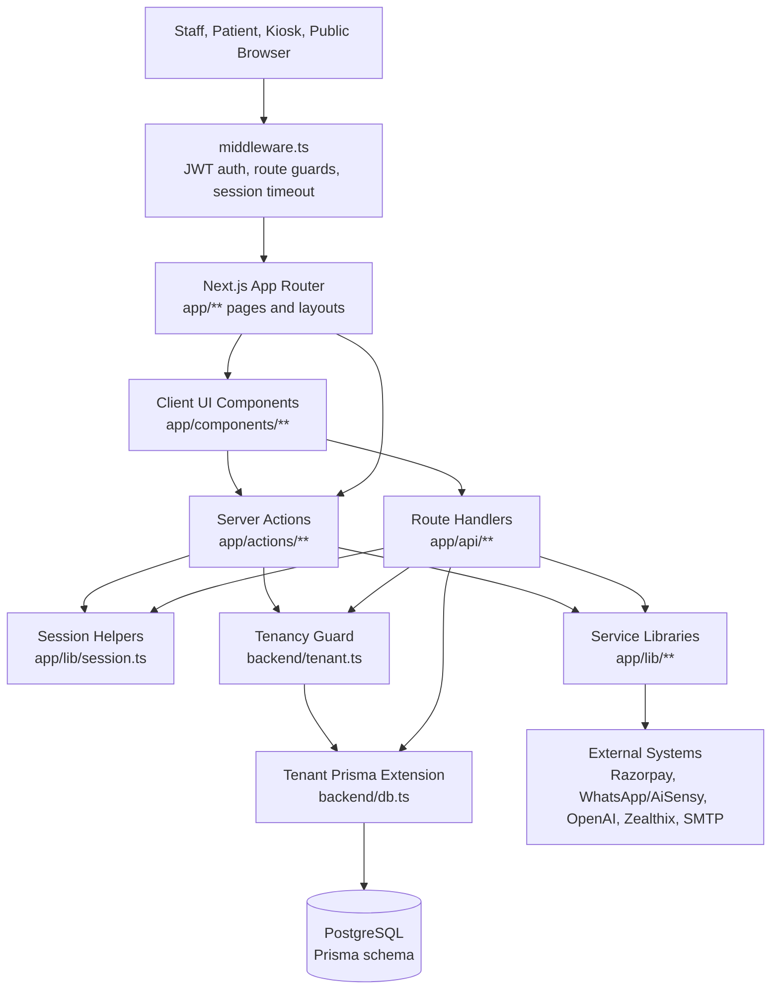
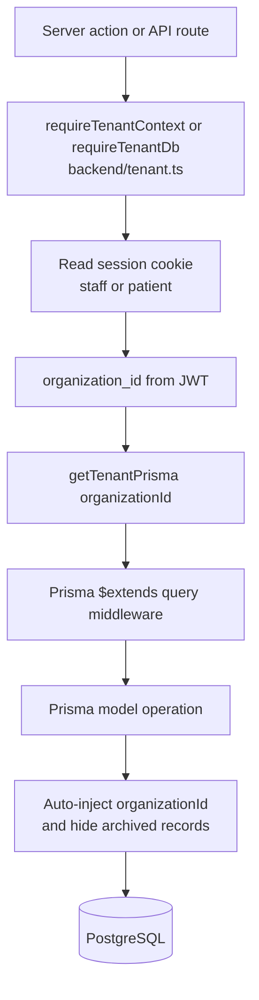
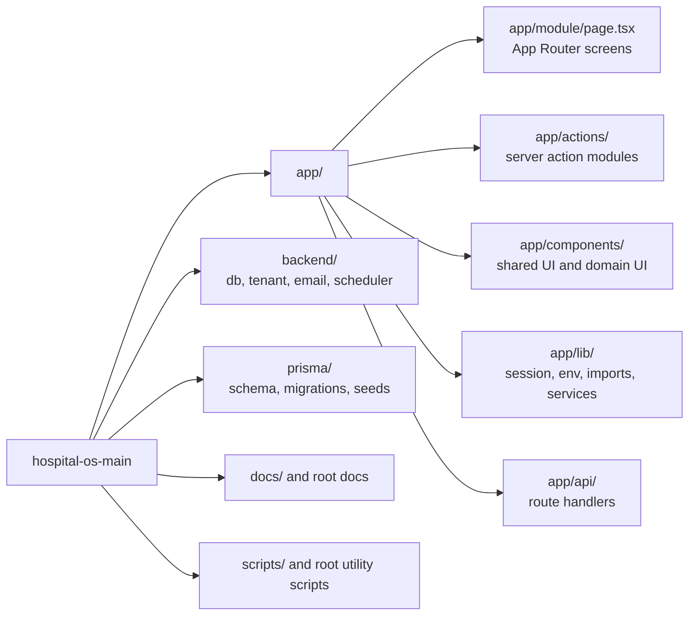
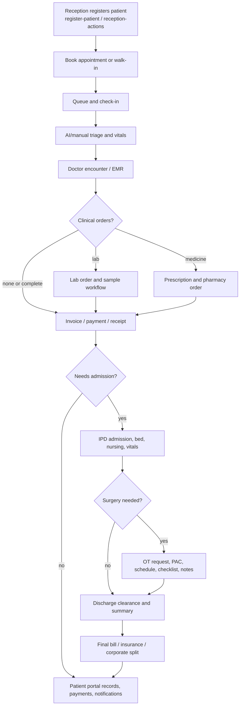
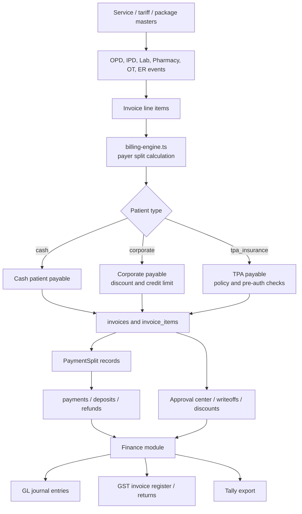
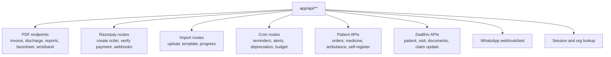
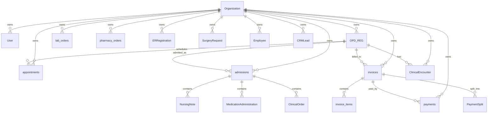
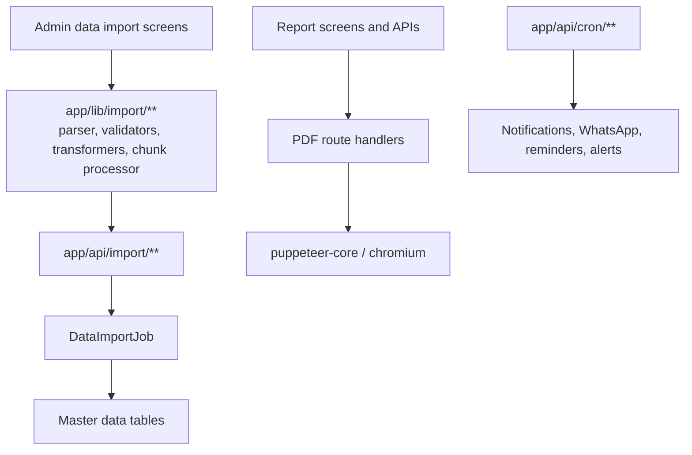

# HospitalOS Project Architecture Flowchart

This document maps the current project architecture from the codebase. It is meant as a fast onboarding guide: start with the high-level diagram, then use the module and workflow diagrams to understand how the app is organized.

## 1. System Overview



Core stack:

- Framework: Next.js 16 App Router with React 19.
- Database: PostgreSQL through Prisma.
- Auth: JWT cookies using `jose`.
- UI: Tailwind CSS, local components, `lucide-react`, charts.
- Integrations: Razorpay payments, WhatsApp/AiSensy messaging, OpenAI clinical helpers, Zealthix insurance APIs, SMTP email, PDF generation.

## 2. Request And Auth Flow

```mermaid
flowchart TD
    Request[Incoming request] --> MW[middleware.ts]
    MW --> Public{Public or exempt API?}
    Public -- yes --> Allow[Allow request]
    Public -- no --> RouteType{Route area}

    RouteType -- /superadmin --> SACookie[superadmin_session JWT]
    RouteType -- /patient --> PatientCookie[patient_session JWT]
    RouteType -- staff modules --> StaffCookie[session JWT]

    SACookie --> SAVerify{Valid?}
    PatientCookie --> PatientVerify{Valid and active?}
    StaffCookie --> StaffVerify{Valid and active?}

    SAVerify -- no --> SuperLogin[/superadmin/login]
    PatientVerify -- no --> PatientLogin[/patient/login]
    StaffVerify -- no --> Login[/login]

    StaffVerify -- yes --> RoleCheck{Role or permission allowed?}
    RoleCheck -- no --> Unauthorized[/login?reason=unauthorized]
    RoleCheck -- yes --> UpdateActivity[Update last_activity cookie]
    PatientVerify -- yes --> UpdatePatientActivity[Update patient_last_activity cookie]
    SAVerify -- yes --> Allow
    UpdateActivity --> Allow
    UpdatePatientActivity --> Allow
```

Important files:

- `middleware.ts`: route protection, role routing, session timeout.
- `app/lib/session.ts`: staff, patient, superadmin, and MFA pending JWT sessions.
- `app/login/actions.ts`: staff login, MFA handoff, role-based redirect.
- `app/patient/login/actions.ts`: patient portal login.

Staff route prefixes are mapped to roles and permissions in `middleware.ts`. Examples:

- `/admin`: admin.
- `/doctor`: admin, doctor.
- `/reception`: admin, receptionist.
- `/finance`: admin, finance.
- `/ipd`: admin, ipd_manager.
- `/billing`: admin, finance, ipd_manager, receptionist, opd_manager.
- `/ot`: admin, ot_manager, doctor, nurse.
- `/er`: admin, er_staff, doctor, nurse.

## 3. Multi-Tenant Data Flow



The app is organization-scoped. Most business tables have `organizationId`. `backend/db.ts` creates a Prisma extension that automatically:

- adds `organizationId` filters to tenant-scoped reads and writes,
- injects `organizationId` on creates,
- hides archived records for selected models unless explicitly requested.

The root tenant model is `Organization`. It owns users, patients, appointments, clinical records, lab, pharmacy, IPD, billing, finance, HR, CRM, OT, ER, notifications, templates, integrations, and master data.

## 4. Folder Map



## 5. UI Shell And Navigation

```mermaid
flowchart TD
    RootLayout[app/layout.tsx<br/>ThemeProvider, ToastProvider, Razorpay checkout script]
    Page[Module page<br/>app/admin, app/reception, app/ipd, etc.]
    AppShell[AppShell<br/>app/components/layout/AppShell.tsx]
    SessionApi[/api/session]
    Sidebar[Sidebar<br/>role-based NAV_BY_ROLE]
    Search[GlobalPatientSearch]
    Bell[NotificationBell]
    Content[Page content]

    RootLayout --> Page
    Page --> AppShell
    AppShell --> SessionApi
    AppShell --> Sidebar
    AppShell --> Search
    AppShell --> Bell
    AppShell --> Content
```

The common staff UI is built around `AppShell`. It fetches `/api/session`, renders a role-specific sidebar, global patient search, notification bell, and page content. Patient portal pages have their own `app/patient/layout.tsx` and patient navigation.

## 6. Main Business Modules

```mermaid
flowchart TD
    HospitalOS[HospitalOS]

    Admin[Admin<br/>configuration, roles, branches, masters, templates, audit]
    Reception[Reception / OPD<br/>registration, appointments, queue, triage, billing]
    Doctor[Doctor / EMR<br/>encounters, SOAP, ICD10, orders, follow-ups, video calls]
    IPD[IPD<br/>admission, bed/ward, nursing, vitals, discharge, settlement]
    Lab[Lab<br/>orders, samples, inventory, reports]
    Pharmacy[Pharmacy<br/>medicine master, orders, inventory, narcotics]
    Billing[Master Billing<br/>invoices, splits, approvals, writeoffs]
    Finance[Finance<br/>collections, GL, GST, Tally, assets, budgets, bank recon]
    Patient[Patient Portal<br/>appointments, records, labs, payments, medicines]
    ER[Emergency Room<br/>registration, triage, MLC, orders, transfer, billing]
    OT[Operation Theatre<br/>requests, PAC, schedule, checklist, notes, billing]
    HR[HR<br/>employees, attendance, leave, shifts]
    CRM[CRM / Call Center<br/>leads, campaigns, engagement, referrals, logs]
    Insurance[Insurance / Corporate<br/>TPA, pre-auth, policies, corporate masters]
    Integrations[Integrations<br/>Razorpay, WhatsApp, Zealthix, OpenAI, SMTP]

    HospitalOS --> Admin
    HospitalOS --> Reception
    HospitalOS --> Doctor
    HospitalOS --> IPD
    HospitalOS --> Lab
    HospitalOS --> Pharmacy
    HospitalOS --> Billing
    HospitalOS --> Finance
    HospitalOS --> Patient
    HospitalOS --> ER
    HospitalOS --> OT
    HospitalOS --> HR
    HospitalOS --> CRM
    HospitalOS --> Insurance
    HospitalOS --> Integrations
```



Representative route groups:

- Admin: `app/admin/**`
- Reception and OPD: `app/reception/**`, `app/opd/**`, `app/opd-manager/**`
- Doctor: `app/doctor/**`
- IPD and nursing: `app/ipd/**`, `app/nurse/**`
- Lab: `app/lab/**`
- Pharmacy: `app/pharmacy/**`
- Billing: `app/billing/**`
- Finance: `app/finance/**`
- Patient portal: `app/patient/**`
- ER: `app/er/**`
- OT: `app/ot/**`
- HR: `app/hr/**`
- CRM and call center: `app/crm/**`, `app/call-center/**`

## 7. Patient Journey Flow



Key action modules:

- `app/actions/register-patient.ts`
- `app/actions/reception-actions.ts`
- `app/actions/triage-actions.ts`
- `app/actions/emr-actions.ts`
- `app/actions/lab-actions.ts`
- `app/actions/pharmacy-actions.ts`
- `app/actions/ipd-actions.ts`
- `app/actions/ipd-nursing-actions.ts`
- `app/actions/ipd-emr-actions.ts`
- `app/actions/ot-actions.ts`
- `app/actions/discharge-actions.ts`
- `app/actions/billing-engine.ts`
- `app/actions/finance-actions.ts`

## 8. Billing And Finance Flow



Important finance and billing files:

- `app/actions/billing-engine.ts`: split calculation for cash, corporate, and TPA patients.
- `app/actions/master-billing-actions.ts`, `app/actions/fee-receipt-actions.ts`, `app/actions/deposit-actions.ts`, `app/actions/writeoff-actions.ts`
- `app/actions/gl-actions.ts`, `app/actions/gst-compliance-actions.ts`, `app/actions/tally-export-actions.ts`
- `app/actions/bank-actions.ts`, `app/actions/budget-actions.ts`, `app/actions/asset-management-actions.ts`

## 9. API And Integration Surface



Representative external service files:

- `app/lib/razorpay.ts`: Razorpay client setup.
- `app/lib/whatsapp.ts`: WhatsApp/AiSensy send helpers.
- `app/lib/ai-service.ts`: OpenAI-powered SOAP, ICD-10, briefs, transcription.
- `backend/email.ts`: email sending.
- `backend/pill-scheduler.ts`: pill reminder scheduling support.
- `backend/services/archive-service.ts`: archival support.

## 10. Data Model Clusters



The Prisma schema is large, but conceptually it clusters into:

- Tenant and security: `Organization`, `Branch`, `User`, `Role`, `Permission`, `ModuleConfig`, `user_mfa`, `system_audit_logs`.
- Patient and OPD: `OPD_REG`, `appointments`, `AppointmentSlot`, `vital_signs`, `triage_results`.
- Clinical EMR: `Clinical_EHR`, `ClinicalEncounter`, `PatientAllergy`, `PrescriptionTemplate`, `ICD10Master`, `ClinicalOrder`, `PhysicianOrder`, `ActiveMedication`.
- IPD: `admissions`, `wards`, `beds`, `NursingNote`, `MedicationAdministration`, `ShiftHandover`, `IPDVitals`, `NursingAssessment`, `DischargeClearance`.
- Lab and pharmacy: `lab_orders`, `LabSampleTracking`, `LabReagentInventory`, `pharmacy_medicine_master`, `pharmacy_orders`, `WardStock`, `NarcoticRegister`.
- Billing and finance: `invoices`, `invoice_items`, `payments`, `PaymentSplit`, `PatientDeposit`, `CreditNote`, `GL_Account`, `GL_JournalEntry`, `GST_Invoice_Register`, `TallyExport`, `BudgetMaster`, `FixedAsset`.
- Insurance and corporate: `insurance_providers`, `insurance_policies`, `insurance_claims`, `CorporateMaster`, `InsurancePreAuth`.
- OT and ER: `OTRoom`, `SurgeryMaster`, `SurgeryRequest`, `OTSchedule`, `ERRegistration`, `MLCRecord`, `ERVitals`, `EROrder`.
- CRM and communications: `CRMLead`, `CRMActivity`, `CRMCampaign`, `Notification`, `MessageDeliveryLog`, `WhatsAppIncomingMessage`, `PillReminder`.

## 11. Import, Reporting, And Background Work



## 12. How To Read Or Extend The Project

For a new screen:

1. Find the route under `app/<module>/.../page.tsx`.
2. Check whether it uses `AppShell` and which client components it imports.
3. Follow imports into `app/actions/<module>-actions.ts`.
4. In the action, look for `requireTenantContext()` or `requireRoleAndTenant()`.
5. Follow Prisma calls to the matching model in `prisma/schema.prisma`.

For a new database feature:

1. Add or update models in `prisma/schema.prisma`.
2. Generate a migration under `prisma/migrations`.
3. Add tenant scoping in `backend/db.ts` if the model belongs to an organization.
4. Add server actions under `app/actions`.
5. Add route screens and components under the relevant `app/<module>` and `app/components` folders.
6. Add role or permission access in `middleware.ts` and sidebar navigation in `app/components/layout/Sidebar.tsx` when needed.

For a new integration:

1. Put reusable client/helper code under `app/lib` or `backend`.
2. Put webhook or external API endpoints under `app/api`.
3. Validate required environment variables in `app/lib/env.ts` if production must fail fast.
4. Store integration state in tenant-scoped Prisma models when data belongs to an organization.
